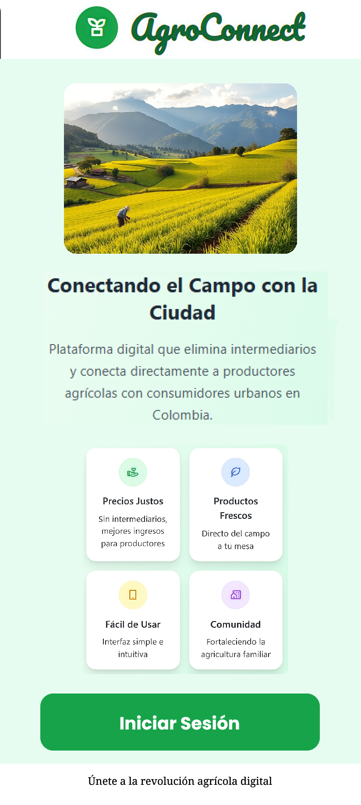
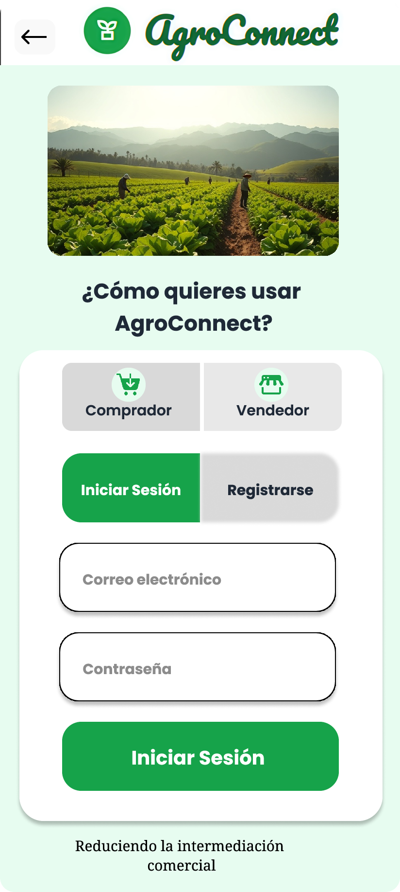

# 🌾 AgroConnect - Conectando el Campo con la Ciudad

**AgroConnect** es una aplicación móvil diseñada para reducir la intermediación comercial entre **productores agrícolas** y **consumidores urbanos**, facilitando la compraventa directa de productos frescos. Este proyecto busca mejorar los ingresos de los agricultores familiares en municipios rurales como Sabanas de San Ángel, Magdalena, al ofrecer una plataforma digital accesible y moderna.

## 🔗 Prototipo en Figma

- Enlace directo: [AgroConnect en Figma](https://www.figma.com/design/EWLGt8zrpcFZ3zGB4z1E5j/AgroConnect?node-id=0-1&t=g3nTJDyqtIbxatMw-1)
- Recomendación: usa el modo Presentación para recorrer los flujos.

## 🎯 Objetivo Principal

Reducir la intermediación comercial que afecta los ingresos de los productores hasta en un 60%, conectándolos directamente con los consumidores finales.

## 📱 Descripción General de la Aplicación

La aplicación funciona como un puente digital con dos roles principales y módulos independientes:

| Rol | Funcionalidades Clave |
| :--- | :--- |
| **Vendedor (Productor)** | Gestión completa de productos, inventario, pedidos, notificaciones y perfil de ventas. |
| **Comprador (Consumidor)** | Catálogo de productos, carrito de compras, proceso de checkout, historial de pedidos y sistema de mensajería. |

El sistema incluye un **Asistente AI integrado** (etiquetado como 'Contáctanos' en el diseño) y un sistema de **mensajería directa** entre usuarios.

## 🧭 Estructura de Navegación y Pantallas

El prototipo de Figma consta de 43 pantallas que cubren el flujo completo de la aplicación.

### Vista rápida (capturas)

#### Autenticación

#### Comprador

#### Vendedor

### Estructura de frames (exportados desde Figma)
- frames/autenticacion: 7 imágenes (page-1.png a page-7.png)
- frames/comprador: 14 imágenes (page-8.png a page-21.png)
- frames/vendedor: 22 imágenes (page-22.png a page-43.png)

### 1. Flujo de Autenticación

| Pantalla | Descripción |
| :--- | :--- |
| **Bienvenida** | Pantalla inicial de presentación. |
| **Selección de Rol** | El usuario elige si desea ingresar como **Comprador** o **Vendedor**. Esta selección es permanente. |
| **Iniciar Sesión / Registrarse** | Formularios de autenticación. |

### 2. Módulo de Vendedor (Productor)

El vendedor tiene una barra de navegación inferior con las siguientes secciones:

| Sección | Descripción | Pantallas Clave |
| :--- | :--- | :--- |
| **Productos** | Dashboard principal. Muestra estadísticas clave (Productos, Pedidos, Ventas) y el listado de productos propios. Incluye la opción **+ Agregar** nuevo producto. | Dashboard, Mis Productos, Agregar Producto. |
| **Pedidos** | Listado y seguimiento de pedidos realizados por los compradores, con diferentes estados. | Pedidos Recientes, Detalle de Pedido. |
| **Mensajes** | Interfaz de chat para comunicarse directamente con los compradores. | Bandeja de Mensajes, Chat. |
| **Perfil** | Información del vendedor, estadísticas de ventas y botón de **Salir**. | Mi Perfil. |

### 3. Módulo de Comprador (Consumidor)

El comprador tiene una barra de navegación inferior con las siguientes secciones:

| Sección | Descripción | Pantallas Clave |
| :--- | :--- | :--- |
| **Inicio** | Catálogo principal de productos disponibles para la venta, con filtros por categoría. | Productos Disponibles, Búsqueda. |
| **Carrito** | Gestión de los productos seleccionados para la compra. | Mi Carrito. |
| **Pedidos** | Historial y seguimiento del estado de los pedidos realizados. | Mis Pedidos. |
| **Mensajes** | Interfaz de chat para comunicarse directamente con los vendedores. | Bandeja de Mensajes, Chat. |

## 💡 Características Técnicas

*   **Diseño Responsivo:** Optimizado para dispositivos móviles (375px de ancho).
*   **Accesibilidad:** Interfaz intuitiva pensada para usuarios con baja alfabetización digital.
*   **Modo Offline:** Funcionalidad básica con sincronización automática al recuperar la conexión.
*   **Tecnología:** Preparado para la conexión con bases de datos externas (Supabase o Firebase).

## 🔮 Próximas Mejoras Sugeridas

*   Integración con API de pagos (Nequi o PayU).
*   Módulo de geolocalización para logística.
*   Panel web para administración avanzada.
*   Estadísticas visuales para análisis de ventas y demanda.

## 🧑‍💻 Desarrolladores

Este proyecto fue desarrollado por:
*   Eusebio Muñoz Martínez
*   Oscar Barrientos Olmos
*   Keren Arias Acosta

*Proyecto de Grado - Ingeniería de Sistemas, Universidad Nacional Abierta y a Distancia (UNAD).*

---

*Este archivo README.md fue generado automáticamente a partir de la documentación original del proyecto.*
